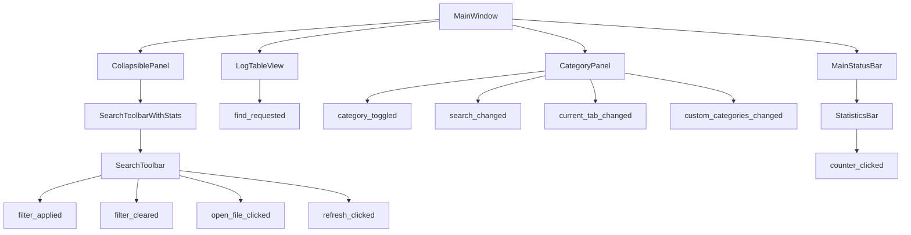
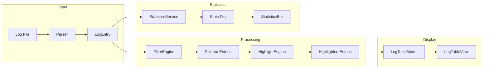

# Design Analysis: Log Viewer Application

This document provides a detailed analysis of the current UI design of the Log Viewer application. It serves as a reference for discussing and making design modifications.

**Last Updated:** 2026-03-13
**Status:** Current implementation reflects completed UI refactoring (Phase 1-6).

**Note:** The "System" column has been renamed to "Category" to better reflect its purpose (showing the full category path of log entries).

---

## 1. Overall Layout Structure

### 1.1 Hierarchy of Blocks

```
MainWindow (QMainWindow)
├── QToolBar (TopToolBarArea)
│   └── CollapsiblePanel
│       └── SearchToolbarWithStats
│           └── SearchToolbar
│               ├── Open File Button (📁)
│               ├── Refresh Button (🔄)
│               ├── Separator (|)
│               ├── Search Input
│               └── Filter Mode Dropdown
├── Central Widget
│   └── QVBoxLayout
│       └── QSplitter (Horizontal)
│           ├── LogTableView (75%)
│           └── CategoryPanel (25%)
│               └── QTabWidget
│                   ├── Categories Tab
│                   │   ├── Search Input
│                   │   └── QTreeView
│                   ├── Processes Tab (placeholder)
│                   └── Threads Tab (placeholder)
└── MainStatusBar (QStatusBar)
    ├── File Label (left)
    ├── Stretch Widget (center)
    └── StatisticsBar (permanent, right)
        ├── CounterWidget (Critical)
        ├── CounterWidget (Error)
        ├── CounterWidget (Warning)
        ├── CounterWidget (Msg)
        ├── CounterWidget (Debug)
        └── CounterWidget (Trace)
```

### 1.2 Spatial Arrangement

```
┌─────────────────────────────────────────────────────────────────────────────┐
│  TOOLBAR AREA (Collapsible)                                                 │
│  ┌────┬────┬───┬────────────────────────────────────┬───────┐              │
│  │ 📁 │ 🔄 │ | │ [Search Input...]                   │ Mode▼ │              │
│  └────┴────┴───┴────────────────────────────────────┴───────┘              │
│  ──────────────────────────────────────────────────────────────────────────│
│  (toggle strip - click to collapse/expand)                                  │
├─────────────────────────────────────────────────────────────────────────────┤
│                           │                                                 │
│    LOG TABLE VIEW         │    CATEGORY PANEL                              │
│    (75% width)            │    (25% width)                                 │
│                           │                                                 │
│  ┌─────┬──────────┬────┬───┐│  ┌─────────────────────────────────────────────┐│
│  │Time │Category  │Type│Msg││  │ [Categories | Processes | Threads]         ││
│  ├─────┼──────────┼────┼───┤│  ├─────────────────────────────────────────────┤│
│  │...  │...       │... │...││  │ 🔍 [Search categories...]                  ││
│  │...  │...       │... │...││  ├─────────────────────────────────────────────┤│
│  │...  │...       │... │...││  │ ☑ Category1                                ││
│  │...  │...       │... │...││  │   ☑ Subcategory1                           ││
│  │...  │...       │... │...││  │   ☑ Subcategory2                           ││
│  │...  │...       │... │...││  │ ☑ Category2                                ││
│  │...  │...       │... │...││  │ 🔍 CustomCategory (pattern)                ││
│  │...  │...       │... │...││  │ ...                                        ││
│  └─────┴──────────┴────┴───┘│  ├─────────────────────────────────────────────┤│
│                           │  │[Check All][Uncheck All]                     ││
│                           │  │[Add Custom][Edit Custom][Remove Custom]      ││
│                           │  └─────────────────────────────────────────────┘│
├─────────────────────────────────────────────────────────────────────────────┤
│  STATUS BAR                                                                 │
│  filename.log  │                    │ [⛔ 0] [🛑 0] [⚠️ 0] [ℹ️ 0] [🟪 0] [🟩 0] │
└─────────────────────────────────────────────────────────────────────────────┘
```

---

## 2. Component Details

### 2.1 MainWindow ([`src/views/main_window.py`](src/views/main_window.py))

**Visual Characteristics:**
- Window title: "Log Viewer" (from `APPLICATION_NAME`)
- Minimum size: 1280×720 (from `WINDOW_MIN_WIDTH`, `WINDOW_MIN_HEIGHT`)
- Background: `#f0f0f0` (light gray)
- Global font: Segoe UI / SF Pro Text, 9pt

**Functional Purpose:**
- Main application container
- Coordinates all child components
- Handles keyboard shortcuts (Ctrl+O, F5, Ctrl+W, Ctrl+F, Ctrl+Q)
- Manages file open/close operations
- Provides dialog access (Find, Settings)

**Key Components:**
- `_search_toolbar`: [`SearchToolbarWithStats`](src/views/widgets/search_toolbar.py) - Combined toolbar wrapper
- `_collapsible_panel`: [`CollapsiblePanel`](src/views/widgets/collapsible_panel.py) - Collapsible container for toolbar
- `_log_table`: [`LogTableView`](src/views/log_table_view.py) - Log display
- `_category_panel`: [`CategoryPanel`](src/views/category_panel.py) - Category filtering
- `_status_bar`: [`MainStatusBar`](src/views/widgets/main_status_bar.py) - Status display with statistics

**Signals:**
- `file_opened(str)` - File opened
- `file_closed()` - File closed
- `refresh_requested()` - Reload request
- `auto_reload_toggled(bool)` - Auto-reload toggle
- `find_requested(str, bool)` - Find text request
- `category_toggled(str, bool)` - Category filter toggle
- `filter_applied(str, str)` - Filter applied
- `filter_cleared()` - Filter cleared
- `counter_toggled(str, bool)` - Counter visibility toggle
- `open_file_requested()` - Open file button clicked

---

### 2.2 CollapsiblePanel ([`src/views/widgets/collapsible_panel.py`](src/views/widgets/collapsible_panel.py))

**Visual Characteristics:**
- Toggle strip at the bottom with arrow indicator (▼/▲)
- Strip height: 6px
- Animated arrow rotation (150ms, OutCubic easing)
- Hover effect: background changes from `#f0f0f0` to `#e8e8e8`

**Functional Purpose:**
- Container widget that can collapse/expand
- Provides toggle strip with arrow indicator
- Emits `toggled(bool)` signal on state change

**Components:**
- `_content_container`: Widget holding the content
- `_toggle_strip`: Interactive strip with arrow indicator

**API:**
- `setContent(widget)` - Set content widget
- `getContent()` - Get content widget
- `isCollapsed()` - Check collapsed state
- `setCollapsed(collapsed)` - Set collapsed state
- `toggle()` - Toggle collapsed state

---

### 2.3 SearchToolbar ([`src/views/widgets/search_toolbar.py`](src/views/widgets/search_toolbar.py))

**Visual Characteristics:**
- Layout: Horizontal (`QHBoxLayout`)
- Margins: 4px all sides
- Spacing: 4px between elements
- Height: ~24px (button height)

**Elements (left to right):**

| Element | Type | Size | Description |
|---------|------|------|-------------|
| Open File | `QPushButton` | 24×24px | Folder icon (📁), opens file dialog |
| Refresh | `QPushButton` | 24×24px | Refresh icon (🔄), reloads current file |
| Separator | `QLabel` | 10px | Text "\|" |
| Search Input | `SearchInput` | Stretchable | Text input for filter |
| Mode Dropdown | `QComboBox` | 80px | Plain/Regex/Simple modes |

**Filter Behavior:**
- **Enter key**: Applies filter if text is not empty, clears filter if text is empty
- **Placeholder text**: "Enter filter text (Enter to apply, empty to clear)..."

**Filter Modes:**
- **Plain**: Case-insensitive substring search
- **Regex**: Python regular expression
- **Simple**: Custom query language (and, or, not)

**Signals:**
- `filter_applied(str, str)` - text, mode (emitted on Enter with non-empty text)
- `filter_cleared()` - emitted on Enter with empty text
- `open_file_clicked()` - open file button clicked
- `refresh_clicked()` - refresh button clicked

---

### 2.4 SearchInput ([`src/views/components/search_input.py`](src/views/components/search_input.py))

**Visual Characteristics:**
- Layout: Single line edit (`QLineEdit`)
- Minimum width: 200px
- Text margins: 4px left, minimal padding
- Placeholder: "Search logs..."

**Styling:**
- Background: `#ffffff` (white)
- Border: 1px solid `#c0c0c0`, 3px border radius
- Focus border: 1px solid `#0066cc`
- Padding: 4px 6px

**Signals:**
- `returnPressed` - Inherited from QLineEdit, emitted on Enter
- `escape_pressed` - Emitted on Escape key (clears input)
- `text_changed` - Emitted when text changes

---

### 2.5 MainStatusBar ([`src/views/widgets/main_status_bar.py`](src/views/widgets/main_status_bar.py))

**Visual Characteristics:**
- Background: `#f5f5f5`
- Top border: 1px solid `#c0c0c0`
- Minimum height: 24px

**Components:**
- `_file_label` (left): Current filename, padding 0 8px
- `_stretch` (center): Expanding spacer widget
- `_statistics_bar` (permanent, right): Statistics counters

**States:**
- Default: "No file open"
- With file: Shows filename only

**API:**
- `set_file(filename)` - Set current file name
- `show_status(message, timeout)` - Show temporary status message
- `clear_status()` - Clear status message
- `update_statistics(stats)` - Update counter values
- `set_counter_visible(type, visible)` - Set counter visibility state
- `is_counter_visible(type)` - Check counter visibility
- `reset_statistics()` - Reset all counters
- `get_visible_types()` - Get list of visible counter types
- `get_hidden_types()` - Get list of hidden counter types

---

### 2.6 StatisticsBar ([`src/views/widgets/statistics_bar.py`](src/views/widgets/statistics_bar.py))

**Visual Characteristics:**
- Layout: Horizontal (`QHBoxLayout`)
- Margins: 0 (flush with edges)
- Spacing: 4px between counters
- Counter order: Critical → Error → Warning → Msg → Debug → Trace

**Counter Colors (from [`LOG_LEVEL_CONFIGS`](src/constants/log_levels.py)):**

| Level | Icon | Background | Text/Border | Inactive Background |
|-------|------|------------|-------------|---------------------|
| Critical | ⛔ | `#FFE4E4` | `#FF4444` | `#f5f5f5` |
| Error | 🛑 | `#FFE4E4` | `#CC0000` | `#f5f5f5` |
| Warning | ⚠️ | `#FFF4E0` | `#FFAA00` | `#f5f5f5` |
| Msg | ℹ️ | `#E0F0FF` | `#0066CC` | `#f5f5f5` |
| Debug | 🟪 | `#F0E8F4` | `#8844AA` | `#f5f5f5` |
| Trace | 🟩 | `#E4FFE4` | `#00AA00` | `#f5f5f5` |

**CounterWidget Features:**
- Click toggles visibility state (visual change only)
- Count always shows total logs
- Inactive state: gray background with colored border hint
- Number formatting: "1.2K", "3.5M" for large counts

---

### 2.7 LogTableView ([`src/views/log_table_view.py`](src/views/log_table_view.py))

**Visual Characteristics:**
- Background: `#ffffff` (white)
- Grid: No grid lines (`setShowGrid(False)`)
- Row height: 16px (from `TABLE_ROW_HEIGHT`)
- Header height: 20px (from `TABLE_HEADER_HEIGHT`)
- Selection: Extended selection (multi-row)
- Alternating row colors: Disabled

**Column Structure:**

| Column | Index | Width | Alignment | Font | Content |
|--------|-------|-------|-----------|------|---------|
| Time | 0 | 80px | Left | Default | Timestamp |
| Category | 1 | 100px | Left | Default | Category path |
| Type | 2 | 60px | Center | Default | Log level icon |
| Message | 3 | 400px+ | Left | Monospace | Log message |

**Log Level Background Colors (from [`LogColors`](src/constants/colors.py)):**

| Level | Background | Icon Color |
|-------|------------|------------|
| CRITICAL | `#FF6B6B` | `#CC0000` |
| ERROR | `#FF8C8C` | `#CC0000` |
| WARNING | `#FFD93D` | `#B8860B` |
| MSG | `#FFFFFF` | `#CCCCCC` |
| DEBUG | `#E8E8E8` | `#999999` |
| TRACE | `#F5F5F5` | `#AAAAAA` |

**Features:**
- Find functionality (Ctrl+F)
- Copy to clipboard (Ctrl+C)
- Select all (Ctrl+A)
- Context menu for row operations
- Highlight delegate for search results

**Model: LogTableModel**
- Column count: 4
- Data roles: DisplayRole, BackgroundRole, ForegroundRole, TextAlignmentRole, FontRole, ToolTipRole

---

### 2.8 CategoryPanel ([`src/views/category_panel.py`](src/views/category_panel.py))

**Visual Characteristics:**
- Layout: Vertical (`QVBoxLayout`)
- Margins: 0 (flush)
- Uses `QTreeView` + `QStandardItemModel` (not `QTreeWidget`)

**Tab Structure:**
| Tab | Index | Status | Content |
|-----|-------|--------|---------|
| Categories | 0 | Active | Tree view with checkboxes |
| Processes | 1 | Placeholder | "Coming soon" label |
| Threads | 2 | Placeholder | "Coming soon" label |

**Categories Tab Components:**
- Search input with icon (🔍)
- Tree view with checkboxes
- Button bar: Check All, Uncheck All, Add Custom, Edit Custom, Remove Custom
- Hierarchical system structure

**Tree View Features:**
- Header hidden
- Root decorations visible
- Animated expansion
- Uniform row heights
- Single selection mode
- No edit triggers
- Horizontal scrollbar disabled

**Custom Categories:**
- Marked with 🔍 icon prefix
- Pattern stored in tooltip
- Special marker: `__custom__:{name}` in UserRole
- Created/edited via [`CustomCategoryDialog`](src/views/widgets/custom_category_dialog.py)

**Signals:**
- `category_toggled(str, bool)` - path, checked
- `search_changed(str)` - search text
- `current_tab_changed(int)` - tab index
- `custom_categories_changed(list)` - custom categories updated

**API:**
- `set_categories(categories)` - Populate tree with categories
- `get_checked_categories()` - Return set of checked category paths
- `get_all_categories()` - Return set of all category paths
- `check_all(checked)` - Check/uncheck all categories
- `check_category(path, checked)` - Check/uncheck specific category
- `clear()` - Clear all categories
- `set_custom_categories(categories)` - Set custom categories
- `get_custom_categories()` - Get custom categories

---

### 2.9 BasePanel ([`src/views/components/base_panel.py`](src/views/components/base_panel.py))

**Note:** This is a base class for QTreeWidget-based panels.

**Visual Characteristics:**
- Inherits from `QTreeWidget`
- Header label support
- Root decorations enabled
- Animated expansion
- Uniform row heights

**Provided Methods:**
- `check_all(checked)` - Check/uncheck all items
- `clear()` - Clear all items
- `get_checked_items()` - Get checked item paths

**Usage:**
- Used by `CategoryPanel` (legacy, now uses QTreeView + QStandardItemModel)

---

## 3. Styling System

### 3.1 Stylesheet Architecture ([`src/styles/stylesheet.py`](src/styles/stylesheet.py))

**Font Selection:**
```python
# macOS
"SF Pro Text", "Helvetica Neue", Arial, sans-serif
# Windows/Others
"Segoe UI", "Roboto", Arial, sans-serif

# Monospace (macOS)
"Menlo", "Monaco", "Courier New", monospace
# Monospace (Windows)
"Consolas", "Courier New", monospace
```

**Global Styles:**
- Widget font: 9pt
- Widget color: `#333333`
- Selection background: `#dcebf7`
- Border color: `#c0c0c0`

**Component Stylesheets:**
- `get_application_stylesheet()` - Global styles
- `get_table_stylesheet()` - Log table
- `get_tab_stylesheet()` - Tab widgets
- `get_tree_stylesheet()` - Tree views
- `get_search_input_stylesheet()` - Search inputs (minimal padding: 4px 6px)
- `get_toolbar_stylesheet()` - Toolbar area
- `get_counter_style(counter_type)` - Counter colors

**SearchInput Styling:**
```python
# Minimal left margin for text (4px)
# Padding: 4px 6px (compact)
# Border radius: 3px
# Focus border: #0066cc
```

### 3.2 Color System ([`src/constants/colors.py`](src/constants/colors.py))

**Color Classes:**
1. `LogColors` - Background colors for log entries
2. `LogIconColors` - Icon colors for log levels
3. `StatsColors` - Statistics counter colors (bg, text, border)

**Semantic Colors:**
- `SELECTION_HIGHLIGHT_COLOR`: `#dcebf7`
- `FIND_HIGHLIGHT_COLOR`: `#FFFF00` (yellow)
- `DEFAULT_TEXT_COLOR`: `#000000`
- `SECONDARY_TEXT_COLOR`: `#666666`
- `BORDER_COLOR`: `#CCCCCC`
- `HEADER_BACKGROUND`: `#F0F0F0`

### 3.3 Dimensions ([`src/constants/dimensions.py`](src/constants/dimensions.py))

**Table Dimensions:**
- Row height: 16px
- Header height: 20px

**Column Widths:**
- Time: 80px
- Category: 100px
- Type: 60px
- Message: 400px (stretchable)
- Minimum: 5px

**Layout Ratios:**
- Log table: 75%
- Category panel: 25%

**Statistics:**
- Icon width: 16px

---

## 4. Component Interactions

### 4.1 Signal Flow Diagram



### 4.2 Data Flow



---

## 5. Architecture Patterns

### 5.1 Model-View Architecture

**LogTableView:**
- Model: `LogTableModel` (QAbstractTableModel)
- View: `LogTableView` (QTableView)
- Delegate: `HighlightDelegate` (custom painting for highlights)

**CategoryPanel:**
- Model: `QStandardItemModel`
- View: `QTreeView`
- Items: `QStandardItem` with checkboxes

### 5.2 Base Class Pattern

**TreePanel** ([`src/views/components/base_panel.py`](src/views/components/base_panel.py)):
- Base class for QTreeWidget-based panels
- Provides: `check_all()`, `clear()`, `get_checked_items()`
- Note: `CategoryPanel` uses QTreeView + QStandardItemModel architecture instead

### 5.3 Service Layer

**Services:**
- `FindService` - Text search in log entries
- `HighlightService` - Pattern highlighting management
- `StatisticsService` - Log level statistics calculation

---

## 6. Terminology Reference

| Term | Definition |
|------|------------|
| **Log Entry** | Single log line with category, time, level, message |
| **Category** | Hierarchical identifier (e.g., "HordeMode/scripts/app") - displayed in the table's Category column |
| **Level** | Log severity: CRITICAL, ERROR, WARNING, MSG, DEBUG, TRACE |
| **Counter** | Statistics widget showing count for a log level |
| **Filter Mode** | Search type: Plain, Regex, or Simple |
| **Highlight** | Visual emphasis on matched text |
| **Custom Category** | User-defined filter pattern |

---

## 7. File Reference

| File | Purpose |
|------|---------|
| [`src/views/main_window.py`](src/views/main_window.py) | Main application window |
| [`src/views/log_table_view.py`](src/views/log_table_view.py) | Log table display |
| [`src/views/category_panel.py`](src/views/category_panel.py) | Category filtering panel |
| [`src/views/widgets/search_toolbar.py`](src/views/widgets/search_toolbar.py) | Search toolbar |
| [`src/views/widgets/collapsible_panel.py`](src/views/widgets/collapsible_panel.py) | Collapsible container widget |
| [`src/views/widgets/statistics_bar.py`](src/views/widgets/statistics_bar.py) | Statistics counter bar |
| [`src/views/widgets/main_status_bar.py`](src/views/widgets/main_status_bar.py) | Status bar with statistics |
| [`src/views/widgets/custom_category_dialog.py`](src/views/widgets/custom_category_dialog.py) | Custom category dialog |
| [`src/views/widgets/error_dialog.py`](src/views/widgets/error_dialog.py) | Error dialog with details |
| [`src/views/widgets/file_tabs.py`](src/views/widgets/file_tabs.py) | File tabs widget |
| [`src/views/widgets/highlight_dialog.py`](src/views/widgets/highlight_dialog.py) | Highlight pattern dialog |
| [`src/views/components/counter_widget.py`](src/views/components/counter_widget.py) | Individual counter widget |
| [`src/views/components/base_panel.py`](src/views/components/base_panel.py) | Base panel classes |
| [`src/views/components/search_input.py`](src/views/components/search_input.py) | Search input widget |
| [`src/views/delegates/highlight_delegate.py`](src/views/delegates/highlight_delegate.py) | Highlight rendering delegate |
| [`src/styles/stylesheet.py`](src/styles/stylesheet.py) | QSS stylesheets |
| [`src/constants/colors.py`](src/constants/colors.py) | Color definitions |
| [`src/constants/dimensions.py`](src/constants/dimensions.py) | Dimension constants |
| [`src/constants/log_levels.py`](src/constants/log_levels.py) | Log level definitions |
| [`src/constants/app_constants.py`](src/constants/app_constants.py) | Application constants |

---

## 8. Recent Changes Summary

### Completed Refactoring (2026-03-12)

All six phases of the UI refactoring have been successfully completed:

#### Phase 1: Constants Extraction ✅
- Created constants module structure (`src/constants/`)
- Extracted all color constants to `colors.py`
- Extracted all dimension constants to `dimensions.py`
- Consolidated log level definitions in `log_levels.py`

#### Phase 2: Component Extraction ✅
- Created `BasePanel` base class in `src/views/components/base_panel.py`
- Created `CounterWidget` component in `src/views/components/counter_widget.py`
- Created `SearchInput` component in `src/views/components/search_input.py`
- Created `HighlightDelegate` in `src/views/delegates/highlight_delegate.py`

#### Phase 3: Service Layer Extraction ✅
- Created `FindService` in `src/services/find_service.py`
- Created `HighlightService` in `src/services/highlight_service.py`
- Created `StatisticsService` in `src/services/statistics_service.py`

#### Phase 4: Controller Refactoring ✅
- Created `FileController` in `src/controllers/file_controller.py`
- Extracted UI node building logic to appropriate locations
- Reduced `MainController` by delegating to specialized controllers

#### Phase 5: View Refactoring ✅
- Reduced `LogTableView` by extracting find logic to service
- Reduced `MainWindow` by extracting components
- Unified tree panel implementations

#### Phase 6: Testing and Verification ✅
- All unit tests pass
- All integration tests pass
- No regressions in functionality

### Key Architectural Improvements

1. **CollapsiblePanel**: New component for collapsible toolbar area
2. **StatisticsBar moved**: Now integrated into `MainStatusBar` instead of `SearchToolbarWithStats`
3. **CategoryPanel**: Uses `QTreeView + QStandardItemModel` architecture (not `QTreeWidget`)
4. **Custom Categories**: Full support for user-defined filter patterns with UI dialogs
5. **Services Layer**: Business logic extracted from views and controllers

---

## 9. Related Documentation

- [UI Refactoring Plan](plans/ui_refactoring_plan.md) - Detailed refactoring tasks and completion status
- [Filter Architecture](plans/filter_architecture.md) - Filtering system architecture and data flow