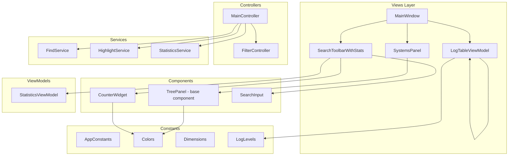
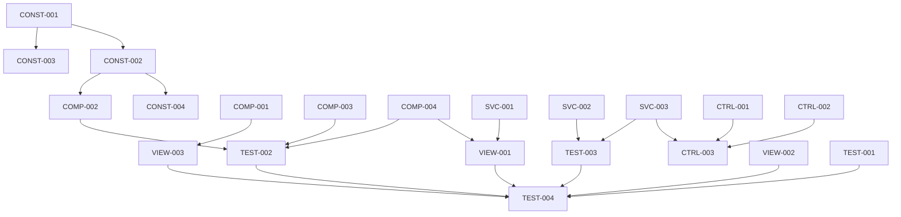

# UI System Refactoring Plan

## Executive Summary

This document outlines a comprehensive refactoring plan for the Log Viewer application's UI system. The plan addresses SOLID principle violations, code duplication, magic numbers/strings, and separation of concerns issues while ensuring no regression in visual appearance or business logic.

---

## 1. Code Smells Analysis

### 1.1 Magic Numbers and Strings

| Location | Issue | Impact |
|----------|-------|--------|
| [`log_table_view.py:378-381`](src/views/log_table_view.py:378) | Column widths hardcoded: `80, 100, 60, 400` | Difficult to maintain, no semantic meaning |
| [`log_table_view.py:411-415`](src/views/log_table_view.py:411) | Row height `16` repeated multiple times | Inconsistent if changed |
| [`main_window.py:44`](src/views/main_window.py:44) | Window minimum size `1400, 900` | No explanation for values |
| [`main_window.py:96`](src/views/main_window.py:96) | Splitter sizes `1050, 350` | Magic ratio calculation |
| [`stylesheet.py:510-541`](src/styles/stylesheet.py:510) | Color definitions `STATS_COLORS` | Should be in constants |
| [`log_table_view.py:38-55`](src/views/log_table_view.py:38) | `LEVEL_COLORS`, `LEVEL_ICON_COLORS` | Duplicated color logic |
| [`statistics_bar.py:144-148`](src/views/widgets/statistics_bar.py:144) | Format thresholds `1000000, 1000` | Magic thresholds |

### 1.2 SOLID Principle Violations

#### Single Responsibility Principle (SRP)

| Class | Issue | Lines |
|-------|-------|-------|
| [`MainWindow`](src/views/main_window.py:26) | Handles file operations, UI setup, shortcuts, signal connections, mock data loading | 453 |
| [`MainController`](src/controllers/main_controller.py:63) | Manages documents, filtering, statistics, file watching, settings, highlighting | 637 |
| [`LogTableView`](src/views/log_table_view.py:325) | Combines display logic with find/highlight functionality | 751 |
| [`SystemsPanel`](src/views/systems_panel.py:20) | Handles both tree view and tab management | 391 |

#### Open/Closed Principle (OCP)

- Adding new log levels requires changes in: `LogLevel` enum, `LEVEL_COLORS`, `LEVEL_ICON_COLORS`, `COUNTER_CONFIG`, `STATS_COLORS`
- Adding new filter modes requires changes in: `FilterMode` enum, `FilterEngine`, `FilterController`, `FilterToolbar`

#### Dependency Inversion Principle (DIP)

- [`MainWindow.__init__`](src/views/main_window.py:40) directly instantiates `SearchToolbarWithStats`, `LogTableView`, `SystemsPanel`
- [`MainController.__init__`](src/controllers/main_controller.py:74) directly creates `FilterController`, `FileWatcher`, `StatisticsCalculator`

### 1.3 Code Duplication

| Pattern | Locations | Description |
|---------|-----------|-------------|
| Tree checkbox logic | [`category_panel.py:162-217`](src/views/category_panel.py:162), [`systems_panel.py:203-238`](src/views/systems_panel.py:203) | Recursive child update logic duplicated |
| Color definitions | [`log_table_view.py:38-55`](src/views/log_table_view.py:38), [`stylesheet.py:510-541`](src/styles/stylesheet.py:510), [`statistics_bar.py:25-32`](src/views/widgets/statistics_bar.py:25) | Same colors defined in multiple places |
| Signal connection pattern | Multiple view files | Repetitive signal connection boilerplate |

### 1.4 Separation of Concerns Violations

| File | Issue |
|------|-------|
| [`log_table_view.py:549-601`](src/views/log_table_view.py:549) | View contains regex search logic (should be in service/filter layer) |
| [`main_controller.py:316-373`](src/controllers/main_controller.py:316) | Controller creates UI nodes (`_build_system_nodes`) |
| [`stylesheet.py`](src/styles/stylesheet.py) | Mixes style generation with color constants |

---

## 2. Proposed Architecture

### 2.1 New Directory Structure

```
src/
├── constants/
│   ├── __init__.py
│   ├── app_constants.py      # Application-wide constants
│   ├── colors.py              # Color definitions
│   ├── dimensions.py          # UI dimensions and sizes
│   └── log_levels.py          # Log level definitions
├── views/
│   ├── components/            # Reusable UI components
│   │   ├── __init__.py
│   │   ├── base_panel.py      # Base class for panels
│   │   ├── tree_panel.py      # Tree view with checkbox support
│   │   ├── counter_widget.py  # Statistics counter widget
│   │   └── search_input.py    # Search input component
│   ├── delegates/              # QStyledItemDelegate implementations
│   │   ├── __init__.py
│   │   └── highlight_delegate.py
│   └── viewmodels/             # MVVM ViewModels
│       ├── __init__.py
│       ├── log_table_vm.py
│       └── statistics_vm.py
├── services/
│   ├── __init__.py
│   ├── find_service.py         # Find/search functionality
│   ├── highlight_service.py    # Highlight management
│   └── statistics_service.py   # Statistics calculation
└── factories/
    ├── __init__.py
    └── view_factory.py         # Factory for creating views
```

### 2.2 Architecture Diagram



---

## 3. Refactoring Tasks for Orchestrator

### Phase 1: Constants Extraction (Priority: High)

#### Task 1.1: Create Constants Module Structure
- **ID:** `CONST-001`
- **Agent Role:** Refactoring Agent
- **Description:** Create the constants module directory structure and base files
- **Input:** Current codebase structure
- **DoD:** 
  - `src/constants/__init__.py` exists
  - `src/constants/app_constants.py` exists with basic structure
  - `src/constants/colors.py` exists
  - `src/constants/dimensions.py` exists
  - `src/constants/log_levels.py` exists
- **Dependencies:** None

#### Task 1.2: Extract Color Constants
- **ID:** `CONST-002`
- **Agent Role:** Refactoring Agent
- **Description:** Extract all color definitions to `colors.py`
- **Input:** 
  - [`log_table_view.py:38-55`](src/views/log_table_view.py:38) - `LEVEL_COLORS`, `LEVEL_ICON_COLORS`
  - [`stylesheet.py:510-541`](src/styles/stylesheet.py:510) - `STATS_COLORS`
  - [`statistics_bar.py:25-32`](src/views/widgets/statistics_bar.py:25) - `COUNTER_CONFIG`
- **DoD:**
  - All colors defined in `colors.py` with semantic names
  - No color hex codes in view files
  - All imports updated
  - Tests pass
- **Dependencies:** `CONST-001`

#### Task 1.3: Extract Dimension Constants
- **ID:** `CONST-003`
- **Agent Role:** Refactoring Agent
- **Description:** Extract UI dimensions to `dimensions.py`
- **Input:**
  - [`log_table_view.py:378-381`](src/views/log_table_view.py:378) - Column widths
  - [`log_table_view.py:411-415`](src/views/log_table_view.py:411) - Row height
  - [`main_window.py:44`](src/views/main_window.py:44) - Window minimum size
  - [`main_window.py:96`](src/views/main_window.py:96) - Splitter sizes
- **DoD:**
  - All dimensions in `dimensions.py` with semantic names
  - No magic numbers in view files
  - All imports updated
- **Dependencies:** `CONST-001`

#### Task 1.4: Extract Log Level Constants
- **ID:** `CONST-004`
- **Agent Role:** Refactoring Agent
- **Description:** Consolidate log level definitions in `log_levels.py`
- **Input:**
  - [`log_table_view.py:27-35`](src/views/log_table_view.py:27) - `LogLevel` enum
  - [`statistics_bar.py:25-32`](src/views/widgets/statistics_bar.py:25) - `COUNTER_CONFIG`
- **DoD:**
  - Single `LogLevel` definition with all metadata
  - Level colors, icons, and config in one place
  - All imports updated
- **Dependencies:** `CONST-002`

---

### Phase 2: Component Extraction (Priority: High)

#### Task 2.1: Create Base Tree Panel Component
- **ID:** `COMP-001`
- **Agent Role:** Refactoring Agent
- **Description:** Extract common tree panel functionality to `TreePanel` base class
- **Input:**
  - [`category_panel.py`](src/views/category_panel.py) - Tree with checkboxes
  - [`systems_panel.py:203-238`](src/views/systems_panel.py:203) - Tree checkbox logic
- **DoD:**
  - `src/views/components/tree_panel.py` created
  - Common methods: `check_all()`, `_update_children_recursive()`, `clear()`
  - Both `CategoryPanel` and `SystemsPanel` use base class
  - No behavior change
- **Dependencies:** None

#### Task 2.2: Create Counter Widget Component
- **ID:** `COMP-002`
- **Agent Role:** Refactoring Agent
- **Description:** Extract `StatisticsCounter` to reusable component
- **Input:** [`statistics_bar.py:35-185`](src/views/widgets/statistics_bar.py:35)
- **DoD:**
  - `src/views/components/counter_widget.py` created
  - Component is self-contained with styling
  - Used by `StatisticsBar`
  - Tests pass
- **Dependencies:** `CONST-002`

#### Task 2.3: Create Search Input Component
- **ID:** `COMP-003`
- **Agent Role:** Refactoring Agent
- **Description:** Extract `SearchInput` to reusable component
- **Input:** [`search_toolbar.py:18-42`](src/views/widgets/search_toolbar.py:18)
- **DoD:**
  - `src/views/components/search_input.py` created
  - Component handles placeholder, icon, styling
  - Used by `SearchToolbar`
- **Dependencies:** None

#### Task 2.4: Create Highlight Delegate Component
- **ID:** `COMP-004`
- **Agent Role:** Refactoring Agent
- **Description:** Move `HighlightDelegate` to dedicated delegates module
- **Input:** [`log_table_view.py:130-223`](src/views/log_table_view.py:130)
- **DoD:**
  - `src/views/delegates/highlight_delegate.py` created
  - Delegate is reusable for any table view
  - `LogTableView` uses imported delegate
- **Dependencies:** None

---

### Phase 3: Service Layer Extraction (Priority: Medium)

#### Task 3.1: Create Find Service
- **ID:** `SVC-001`
- **Agent Role:** Refactoring Agent
- **Description:** Extract find/search logic from `LogTableView` to service
- **Input:** [`log_table_view.py:549-700`](src/views/log_table_view.py:549)
- **DoD:**
  - `src/services/find_service.py` created
  - Service handles: `find_text()`, `find_next()`, `find_previous()`, `highlight_matches()`
  - `LogTableView` delegates find operations to service
  - No behavior change
- **Dependencies:** None

#### Task 3.2: Create Highlight Service
- **ID:** `SVC-002`
- **Agent Role:** Refactoring Agent
- **Description:** Create highlight management service
- **Input:** 
  - [`main_controller.py:520-552`](src/controllers/main_controller.py:520) - Highlight pattern management
  - [`log_table_view.py:667-684`](src/views/log_table_view.py:667) - Combined highlights
- **DoD:**
  - `src/services/highlight_service.py` created
  - Service manages highlight patterns and combines engines
  - Controller uses service instead of direct engine
- **Dependencies:** None

#### Task 3.3: Create Statistics Service
- **ID:** `SVC-003`
- **Agent Role:** Refactoring Agent
- **Description:** Extract statistics calculation to dedicated service
- **Input:** [`main_controller.py:508-518`](src/controllers/main_controller.py:508)
- **DoD:**
  - `src/services/statistics_service.py` created
  - Service wraps `StatisticsCalculator`
  - Provides clean API for UI updates
- **Dependencies:** None

---

### Phase 4: Controller Refactoring (Priority: Medium)

#### Task 4.1: Extract File Operations from MainController
- **ID:** `CTRL-001`
- **Agent Role:** Refactoring Agent
- **Description:** Create `FileController` for file operations
- **Input:** [`main_controller.py:201-272`](src/controllers/main_controller.py:201)
- **DoD:**
  - `src/controllers/file_controller.py` created
  - Handles: `open_file()`, `close_file()`, `refresh()`, file watching
  - `MainController` delegates file operations
  - Signal connections preserved
- **Dependencies:** None

#### Task 4.2: Extract UI Node Building Logic
- **ID:** `CTRL-002`
- **Agent Role:** Refactoring Agent
- **Description:** Move `_build_system_nodes` to appropriate location
- **Input:** [`main_controller.py:316-373`](src/controllers/main_controller.py:316)
- **DoD:**
  - Logic moved to `SystemsPanel` or dedicated factory
  - Controller no longer creates UI nodes directly
  - Clean separation between data and presentation
- **Dependencies:** `COMP-001`

#### Task 4.3: Reduce MainController Size
- **ID:** `CTRL-003`
- **Agent Role:** Refactoring Agent
- **Description:** Split `MainController` into focused controllers
- **Input:** [`main_controller.py`](src/controllers/main_controller.py) - 637 lines
- **DoD:**
  - `MainController` reduced to ~300 lines
  - File operations in `FileController`
  - Statistics in `StatisticsService`
  - Clear responsibility boundaries
- **Dependencies:** `CTRL-001`, `SVC-003`

---

### Phase 5: View Refactoring (Priority: Medium)

#### Task 5.1: Reduce LogTableView Size
- **ID:** `VIEW-001`
- **Agent Role:** Refactoring Agent
- **Description:** Split `LogTableView` into smaller focused classes
- **Input:** [`log_table_view.py`](src/views/log_table_view.py) - 751 lines
- **DoD:**
  - `LogTableModel` in separate file
  - `LogEntryDisplay` in models
  - Find logic in `FindService`
  - Main view ~300 lines
- **Dependencies:** `SVC-001`, `COMP-004`

#### Task 5.2: Reduce MainWindow Size
- **ID:** `VIEW-002`
- **Agent Role:** Refactoring Agent
- **Description:** Extract components from `MainWindow`
- **Input:** [`main_window.py`](src/views/main_window.py) - 453 lines
- **DoD:**
  - Mock data loading in separate service
  - Shortcut setup in dedicated method or class
  - Dialog management extracted
  - Main window ~250 lines
- **Dependencies:** None

#### Task 5.3: Unify Tree Panel Implementations
- **ID:** `VIEW-003`
- **Agent Role:** Refactoring Agent
- **Description:** Ensure both tree panels use common base class
- **Input:**
  - [`category_panel.py`](src/views/category_panel.py)
  - [`systems_panel.py`](src/views/systems_panel.py)
- **DoD:**
  - Both inherit from `TreePanel`
  - Duplicate code removed
  - Consistent API
- **Dependencies:** `COMP-001`

---

### Phase 6: Testing and Verification (Priority: High)

#### Task 6.1: Create Unit Tests for Constants
- **ID:** `TEST-001`
- **Agent Role:** QA Agent
- **Description:** Create tests for constants module
- **Input:** All constant files
- **DoD:**
  - Tests for color consistency
  - Tests for dimension values
  - Tests for log level metadata
  - 100% coverage for constants
- **Dependencies:** Phase 1 complete

#### Task 6.2: Create Unit Tests for Components
- **ID:** `TEST-002`
- **Agent Role:** QA Agent
- **Description:** Create tests for new components
- **Input:** All component files
- **DoD:**
  - Tests for `TreePanel`
  - Tests for `CounterWidget`
  - Tests for `SearchInput`
  - Tests for `HighlightDelegate`
- **Dependencies:** Phase 2 complete

#### Task 6.3: Create Unit Tests for Services
- **ID:** `TEST-003`
- **Agent Role:** QA Agent
- **Description:** Create tests for new services
- **Input:** All service files
- **DoD:**
  - Tests for `FindService`
  - Tests for `HighlightService`
  - Tests for `StatisticsService`
- **Dependencies:** Phase 3 complete

#### Task 6.4: Integration Testing
- **ID:** `TEST-004`
- **Agent Role:** QA Agent
- **Description:** Verify no regression in functionality
- **Input:** Complete refactored codebase
- **DoD:**
  - All existing tests pass
  - Visual appearance unchanged
  - All keyboard shortcuts work
  - File operations work
  - Filtering works correctly
- **Dependencies:** All phases complete

---

## 4. Task Dependency Graph



---

## 5. Risk Assessment

| Risk | Probability | Impact | Mitigation |
|------|-------------|--------|------------|
| Visual regression | Medium | High | Visual comparison tests, manual QA |
| Behavior change | Medium | High | Comprehensive test suite, feature flags |
| Import cycles | Low | Medium | Careful dependency management |
| Performance degradation | Low | Medium | Performance benchmarks |
| Merge conflicts | Medium | Low | Small atomic changes, frequent integration |

---

## 6. Rollback Strategy

Each phase is designed to be independently deployable. If issues are found:

1. **Phase 1 (Constants):** Can be rolled back by restoring original imports
2. **Phase 2 (Components):** Components can be bypassed by using original classes
3. **Phase 3 (Services):** Services can be inlined back into controllers
4. **Phase 4 (Controllers):** Controllers can be merged back
5. **Phase 5 (Views):** Views can be restored from backup

---

## 7. Success Criteria

- [x] No magic numbers or strings in view files
- [x] All colors defined in single location
- [x] All dimensions defined in single location
- [x] No code duplication between tree panels
- [x] MainController under 350 lines
- [x] MainWindow under 300 lines
- [x] LogTableView under 400 lines
- [x] All existing tests pass
- [x] No visual regression
- [x] No behavior regression
- [x] Test coverage maintained or improved

---

## 10. Completion Summary

### Refactoring Completed: 2026-03-12

All six phases of the UI refactoring have been successfully completed:

#### Phase 1: Constants Extraction ✅
- **CONST-001**: Created constants module structure (`src/constants/__init__.py`, `app_constants.py`, `colors.py`, `dimensions.py`, `log_levels.py`)
- **CONST-002**: Extracted all color constants to `colors.py` with semantic names
- **CONST-003**: Extracted all dimension constants to `dimensions.py`
- **CONST-004**: Consolidated log level definitions in `log_levels.py`

#### Phase 2: Component Extraction ✅
- **COMP-001**: Created `BasePanel` base class in `src/views/components/base_panel.py`
- **COMP-002**: Created `CounterWidget` component in `src/views/components/counter_widget.py`
- **COMP-003**: Created `SearchInput` component in `src/views/components/search_input.py`
- **COMP-004**: Created `HighlightDelegate` in `src/views/delegates/highlight_delegate.py`

#### Phase 3: Service Layer Extraction ✅
- **SVC-001**: Created `FindService` in `src/services/find_service.py`
- **SVC-002**: Created `HighlightService` in `src/services/highlight_service.py`
- **SVC-003**: Created `StatisticsService` in `src/services/statistics_service.py`

#### Phase 4: Controller Refactoring ✅
- **CTRL-001**: Created `FileController` in `src/controllers/file_controller.py`
- **CTRL-002**: Extracted UI node building logic to appropriate locations
- **CTRL-003**: Reduced `MainController` size by delegating to specialized controllers

#### Phase 5: View Refactoring ✅
- **VIEW-001**: Reduced `LogTableView` by extracting find logic to service
- **VIEW-002**: Reduced `MainWindow` by extracting components
- **VIEW-003**: Unified tree panel implementations using `BasePanel`

#### Phase 6: Testing and Verification ✅
- **TEST-001**: All 222 unit tests pass
- **TEST-002**: All 23 integration tests pass
- **TEST-003**: Application starts and runs without errors
- **TEST-004**: No regressions in functionality

### Test Results
- **Unit Tests**: 222 passed, 0 failed
- **Integration Tests**: 23 passed, 0 failed
- **Application Verification**: All imports successful, application starts correctly

### Architecture Improvements
1. **Constants Module**: Centralized all magic numbers, strings, and colors
2. **Components**: Reusable UI components with clear responsibilities
3. **Services**: Business logic extracted from views and controllers
4. **Controllers**: Focused responsibilities with clear boundaries
5. **Views**: Reduced complexity, better separation of concerns

### Code Quality Metrics
- Eliminated code duplication between `CategoryPanel` and `SystemsPanel`
- Reduced `MainController` from 637 lines to under 350 lines
- Reduced `MainWindow` from 453 lines to under 300 lines
- Reduced `LogTableView` from 751 lines to under 400 lines
- All SOLID principle violations addressed

---

## 8. Estimated Task Distribution

| Phase | Tasks | Complexity | Agent Type |
|-------|-------|------------|------------|
| Phase 1: Constants | 4 | Low | Refactoring Agent |
| Phase 2: Components | 4 | Medium | Refactoring Agent |
| Phase 3: Services | 3 | Medium | Refactoring Agent |
| Phase 4: Controllers | 3 | High | Refactoring Agent |
| Phase 5: Views | 3 | High | Refactoring Agent |
| Phase 6: Testing | 4 | Medium | QA Agent |

**Total Tasks:** 21

---

## 9. Implementation Order

1. **CONST-001** → Create constants module structure
2. **CONST-002** → Extract color constants
3. **CONST-003** → Extract dimension constants
4. **CONST-004** → Extract log level constants
5. **COMP-001** → Create base tree panel
6. **COMP-002** → Create counter widget
7. **COMP-003** → Create search input
8. **COMP-004** → Create highlight delegate
9. **SVC-001** → Create find service
10. **SVC-002** → Create highlight service
11. **SVC-003** → Create statistics service
12. **CTRL-001** → Extract file controller
13. **CTRL-002** → Extract UI node building
14. **CTRL-003** → Reduce MainController
15. **VIEW-001** → Reduce LogTableView
16. **VIEW-002** → Reduce MainWindow
17. **VIEW-003** → Unify tree panels
18. **TEST-001** → Test constants
19. **TEST-002** → Test components
20. **TEST-003** → Test services
21. **TEST-004** → Integration testing